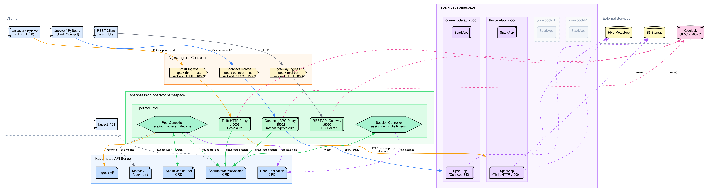

# Spark Session Operator

Kubernetes-оператор для управления пулами интерактивных Spark-серверов (Spark Connect и Spark Thrift Server) с поддержкой управления сессиями на уровне пользователей, OIDC-аутентификацией, автоскейлингом и таймаутом неактивности.

## Архитектура



> Исходник диаграммы: [`docs/architecture.dot`](docs/architecture.dot). Перегенерация: `dot -Tpng docs/architecture.dot -o docs/architecture.png -Gdpi=150`.

Оператор управляет двумя CRD:

- **SparkSessionPool** — масштабируемый пул экземпляров SparkApplication (Spark Connect или Thrift Server). Контроллер создаёт и удаляет SparkApplication CR через Spark Operator в зависимости от нагрузки. Каждый пул имеет собственный hostname и динамически создаваемый Ingress для маршрутизации.
- **SparkInteractiveSession** — привязка сессии к конкретному пользователю. Контроллер назначает пользователей на наименее загруженный экземпляр пула, контролирует квоты и обрабатывает таймауты неактивности.

Дополнительные компоненты, работающие в том же бинарном файле:

- **REST API Gateway** (`:8080`) — HTTP API с OIDC-аутентификацией для просмотра и удаления сессий
- **Thrift HTTP Proxy** (`:10009`) — HTTP reverse proxy с Basic-аутентификацией (Keycloak ROPC), автоматически создающий сессии для Thrift (HiveServer2 HTTP transport) подключений
- **Connect gRPC Proxy** (`:15002`) — gRPC-прокси, автоматически создающий сессии для Spark Connect подключений
- **Metrics Client** — опрашивает Kubernetes Metrics API (`metrics.k8s.io`) для скейлинга по CPU/памяти

### Маршрутизация по hostname

Каждый пул определяет поле `spec.host` (например, `spark-connect-default.example.com`). Контроллер пула автоматически создаёт Ingress для каждого пула в namespace оператора, маршрутизируя трафик на соответствующий порт прокси:

| Тип пула | Бэкенд Ingress | Протокол | Порт |
|----------|---------------|----------|------|
| `connect` | gRPC-прокси | GRPC | 15002 |
| `thrift`  | Thrift HTTP-прокси | HTTP | 10009 |

Это позволяет иметь несколько пулов одного типа (например, `connect-default-pool` и `connect-heavy-pool`). Прокси определяет целевой пул по hostname: Thrift HTTP-прокси использует стандартный заголовок `Host` (nginx сохраняет его для HTTP-бэкендов), а Connect gRPC-прокси читает `X-Forwarded-Host` из gRPC-метаданных (nginx перезаписывает `:authority` для gRPC-бэкендов, поэтому аннотация `configuration-snippet` пробрасывает оригинальный host).

### Масштабирование с нуля

Пулы поддерживают `replicas.min: 0`. Когда пользователь подключается и экземпляров нет, прокси создаёт сессию CR в состоянии `Pending`. Контроллер пула учитывает ожидающие неназначенные сессии наряду с активными, что запускает создание SparkApplication даже при нулевом количестве работающих экземпляров.

### Пути создания сессий

| Путь | Протокол | Сценарий использования |
|------|----------|----------------------|
| **Proxy** (основной) | Thrift HTTP / gRPC | Интерактивные пользователи из Jupyter, DBeaver, PySpark |
| **kubectl / K8s API** | SparkInteractiveSession CR | Автоматизация / CI-пайплайны |
| **REST API** | HTTP (только чтение + удаление) | Просмотр сессий, получение деталей, завершение сессий |

Пользователи подключаются с доменными учётными данными (логин/пароль Keycloak). Прокси обменивает учётные данные на JWT через Keycloak ROPC grant, выбирает пул по hostname, создаёт сессию, ожидает её активации и прозрачно проксирует трафик. Keepalive поддерживается автоматически, пока соединение открыто.

## Требования

- Kubernetes-кластер v1.28+
- Установленный [Spark Operator](https://github.com/kubeflow/spark-operator) (управляет SparkApplication CR)
- Установленный [Metrics Server](https://github.com/kubernetes-sigs/metrics-server) (необходим для скейлинга по `cpu`/`memory`; не нужен для `activeSessions`)
- [Keycloak](https://www.keycloak.org/) или совместимый OIDC-провайдер (с включённым ROPC grant для клиента прокси)
- Nginx Ingress Controller (для динамической маршрутизации через per-pool Ingress)
- `kubectl`, настроенный для доступа к кластеру
- Go 1.23+ (для сборки из исходников)
- Docker (для сборки контейнерного образа)

## Быстрый старт

### 1. Установка CRD

```sh
make install
```

Устанавливает CRD `SparkSessionPool` и `SparkInteractiveSession` в кластер.

### 2. Сборка и публикация образа

```sh
export IMG=your-registry.example.com/spark-session-operator:latest
make docker-build docker-push IMG=$IMG
```

### 3. Деплой оператора

```sh
make deploy IMG=$IMG
```

Разворачивает controller manager, service account, RBAC-роли и CRD в namespace `spark-session-operator`.

### 4. Создание SparkSessionPool

Каждый пул управляет набором идентичных экземпляров Spark-сервера. Пулы идентифицируются по hostname — можно иметь несколько пулов одного типа с разными ресурсными профилями (например, `connect-default-pool` и `connect-heavy-pool`).

Примените примеры пулов:

```sh
# Пулы Spark Connect (default + heavy)
kubectl apply -f config/samples/connect-pool.yaml
kubectl apply -f config/samples/connect-heavy-pool.yaml

# Пулы Spark Thrift Server
kubectl apply -f config/samples/thrift-pool.yaml
kubectl apply -f config/samples/thrift-heavy-pool.yaml
```

Пул определяет три вещи:

**1. Тип сервера, hostname и количество реплик**

```yaml
spec:
  type: connect                                      # "connect" или "thrift"
  host: spark-connect-default.example.com            # Hostname для маршрутизации через Ingress
  replicas:
    min: 0             # Минимум экземпляров (0 = масштабирование с нуля)
    max: 5             # Максимум экземпляров
```

**2. Шаблон SparkApplication** — полная спецификация `SparkApplication` для Spark Operator, используемая при создании каждого экземпляра. Здесь настраиваются Spark-образ, ресурсы driver/executor, Hive metastore, S3, Delta Lake и т.д. Оператор создаёт один `SparkApplication` CR на каждый экземпляр пула по этому шаблону.

**3. Политика сессий** — управление лимитами на пользователя и очисткой неактивных сессий:

```yaml
spec:
  sessionPolicy:
    maxSessionsPerUser: 5       # Максимум одновременных сессий на пользователя
    maxTotalSessions: 200       # Максимум сессий во всём пуле
    idleTimeoutMinutes: 720     # Завершение сессий, неактивных более 12 часов
    defaultSessionConf:         # Конфигурация Spark по умолчанию для каждой сессии
      spark.executor.memory: "4g"
    quotas:                     # Переопределения для отдельных пользователей/групп
      - match:
          users: ["admin"]
        maxSessionsPerUser: 20
        sessionConf:
          spark.dynamicAllocation.maxExecutors: "20"
```

Проверка состояния пулов:

```sh
kubectl get sparksessionpools -n spark-dev
# NAME                   TYPE      REPLICAS   READY   SESSIONS   AGE
# connect-default-pool   connect   0          0       0          5m
# connect-heavy-pool     connect   0          0       0          5m
# thrift-default-pool    thrift    0          0       0          5m
```

Оператор автоматически создаёт Ingress для каждого пула. Проверка:

```sh
kubectl get ingress -n spark-session-operator
# NAME                          HOSTS                                   ...
# connect-default-pool-connect  spark-connect-default.example.com       ...
# connect-heavy-pool-connect    spark-connect-heavy.example.com         ...
# thrift-default-pool-thrift    spark-thrift-default.example.com        ...
```

### 5. Настройка Keycloak (для аутентификации через прокси)

Прокси аутентифицирует пользователей через Keycloak Resource Owner Password Credentials (ROPC) grant. Пропустите этот шаг, если сессии создаются только через `kubectl`.

1. В вашем realm Keycloak создайте нового клиента (например, `spark-session-operator`)
2. Установите **Client authentication** в `On` (confidential) или `Off` (public), в зависимости от требований безопасности
3. В **Authentication flow overrides** включите **Direct access grants** (это активирует ROPC flow)
4. Запишите **Client ID** и **Client secret** (если confidential)

Затем передайте учётные данные оператору:

```sh
--oidc-issuer-url=https://keycloak.example.com/realms/spark \
--oidc-client-id=spark-session-operator \
--oidc-client-secret=<client-secret>   # не указывайте, если public client
```

Пользователи аутентифицируются обычным логином и паролем Keycloak — прокси автоматически обменивает их на JWT.

Для разработки или тестирования без Keycloak можно полностью отключить валидацию токенов:

```sh
--oidc-skip-validation=true
```

В этом режиме прокси принимает любые username/password без обращения к OIDC-провайдеру. Имя пользователя используется как есть для привязки сессии. **Не используйте в продакшене.**

### 6. Подключение через прокси

**DBeaver (Thrift через HTTP transport):**
1. Создайте новое подключение Apache Hive
2. JDBC URL: `jdbc:hive2://spark-thrift-default.example.com:80/default;transportMode=http;httpPath=cliservice`
3. Аутентификация: введите доменные логин и пароль
4. Сессия создаётся автоматически при подключении

**PyHive (Thrift через HTTP transport):**
```python
from pyhive import hive

conn = hive.connect(
    host='spark-thrift-default.example.com',
    port=80,
    auth='CUSTOM',
    username='alice',
    password='my-domain-password',
    thrift_transport=hive.Transport.HTTP,
    http_path='cliservice',
)
```

**PySpark (Spark Connect):**
```python
from pyspark.sql import SparkSession
import base64

token = base64.b64encode(b"alice:my-domain-password").decode()

spark = SparkSession.builder \
    .remote("sc://spark-connect-default.example.com:443/;token=" + token) \
    .getOrCreate()

spark.sql("SELECT 1").show()
```

Или с явными gRPC metadata (незащищённый канал):
```python
spark = SparkSession.builder \
    .remote("sc://spark-connect-default.example.com:80/;user_id=" + token) \
    .getOrCreate()
```

Или создайте session CR напрямую (для автоматизации):

```sh
kubectl apply -f config/samples/session.yaml
```

При создании сессий через `kubectl apply` Keycloak и прокси не нужны — подключайтесь напрямую к бэкенду. Получите endpoint сессии:

```sh
kubectl get sparkinteractivesession <session-name> -n spark-dev -o jsonpath='{.status.endpoint}'
```

Затем проброс портов к назначенному экземпляру:

```sh
# Spark Connect (порт 8424 внутри пода)
kubectl port-forward pod/<assigned-instance-driver> -n spark-dev 15002:8424

# Spark Thrift Server (порт 10001 внутри пода, HTTP transport)
kubectl port-forward pod/<assigned-instance-driver> -n spark-dev 10009:10001
```

## Конфигурация

Оператор принимает следующие флаги командной строки:

| Флаг | По умолчанию | Описание |
|------|-------------|----------|
| `--namespace` | `spark-dev` | Namespace для отслеживания и управления ресурсами |
| `--proxy-namespace` | `spark-session-operator` | Namespace, где живут Service прокси и Ingress-ы |
| `--gateway-addr` | `:8080` | Адрес REST API gateway |
| `--thrift-proxy-addr` | `:10009` | Адрес Thrift HTTP-прокси |
| `--connect-proxy-addr` | `:15002` | Адрес Spark Connect gRPC-прокси |
| `--oidc-issuer-url` | _(пусто)_ | URL OIDC-издателя (например, `https://keycloak.example.com/realms/spark`) |
| `--oidc-audience` | _(пусто)_ | Ожидаемая OIDC audience |
| `--oidc-user-claim` | `sub` | JWT claim, содержащий имя пользователя |
| `--oidc-groups-claim` | `groups` | JWT claim, содержащий группы пользователя |
| `--oidc-skip-validation` | `false` | Пропустить валидацию OIDC-токена (только для разработки) |
| `--oidc-client-id` | _(пусто)_ | OAuth client ID для Keycloak ROPC grant (используется прокси) |
| `--oidc-client-secret` | _(пусто)_ | OAuth client secret для Keycloak ROPC grant (опционально) |
| `--leader-elect` | `false` | Включить leader election для высокой доступности |
| `--health-probe-bind-address` | `:8081` | Адрес health/readiness проб |
| `--metrics-bind-address` | `0` | Адрес эндпоинта метрик (`0` = отключено) |
| `--metrics-secure` | `true` | Отдавать метрики по HTTPS |

## REST API

API эндпоинты требуют заголовок `Authorization: Bearer <token>` с Keycloak JWT.

**Для пользователей** — откройте ссылку в браузере, введите доменные учётные данные и скопируйте токен из ответа:
```
https://keycloak.example.com/realms/YourRealm/protocol/openid-connect/auth
  ?client_id=spark-session-operator
  &redirect_uri=https://spark-api.example.com/callback
  &response_type=code
  &scope=openid+profile+email
```

**Для скриптов — получите токен программно через curl:
```sh
TOKEN=$(curl -s -X POST \
  "https://keycloak.example.com/realms/YourRealm/protocol/openid-connect/token" \
  -d "grant_type=password&client_id=spark-session-operator" \
  -d "username=alice&password=my-password" | jq -r .access_token)

curl -H "Authorization: Bearer $TOKEN" \
  https://spark-api.example.com/api/v1/pools
```

При включённом `--oidc-skip-validation` любой валидный по формату JWT принимается без проверки подписи.

| Метод | Путь | Описание |
|-------|------|----------|
| `GET` | `/api/v1/sessions` | Список ваших сессий |
| `GET` | `/api/v1/sessions/{name}` | Детали сессии |
| `DELETE` | `/api/v1/sessions/{name}` | Завершить сессию |

Неаутентифицированные эндпоинты (токен не требуется):

| Метод | Путь | Описание |
|-------|------|----------|
| `GET` | `/api/v1/pools` | Список всех пулов (реплики, готовность, активные сессии) |
| `GET` | `/healthz` | Liveness probe |
| `GET` | `/readyz` | Readiness probe |

### Ответ пулов

Возвращается `GET /api/v1/pools`.

```json
[
  {
    "name": "connect-default-pool",
    "type": "connect",
    "host": "spark-connect-default.example.com",
    "minReplicas": 0,
    "maxReplicas": 5,
    "currentReplicas": 2,
    "readyReplicas": 2,
    "totalActiveSessions": 3,
    "sessionPolicy": {
      "maxSessionsPerUser": 5,
      "maxTotalSessions": 200,
      "idleTimeoutMinutes": 720,
      "defaultSessionConf": {
        "spark.executor.memory": "4g"
      }
    }
  }
]
```

### Ответ сессии

Возвращается `GET` и `DELETE` эндпоинтами сессий.

```json
{
  "name": "session-alice-12345",
  "user": "alice",
  "pool": "connect-default-pool",
  "state": "Active",
  "assignedInstance": "connect-default-pool-54321",
  "createdAt": "2026-02-25T10:00:00Z",
  "lastActivityAt": "2026-02-25T10:05:00Z"
}
```

## Справочник CRD

### SparkSessionPool

```yaml
apiVersion: sparkinteractive.io/v1alpha1
kind: SparkSessionPool
metadata:
  name: connect-default-pool
  namespace: spark-dev
spec:
  type: connect                    # "connect" или "thrift"
  host: spark-connect-default.example.com  # Hostname для маршрутизации через Ingress
  replicas:
    min: 0                         # Минимум экземпляров (0 = масштабирование с нуля)
    max: 5                         # Максимум экземпляров
  scaling:
    metrics:
      type: activeSessions         # activeSessions | cpu | memory
      targetPerInstance: 20         # Семантика целевого значения описана ниже
    scaleUpThreshold: "0.8"        # Увеличение при нагрузке > 80% от target (только activeSessions)
    scaleDownThreshold: "0.3"      # Уменьшение при нагрузке < 30% от target
    cooldownSeconds: 300           # Минимум секунд между действиями скейлинга
    drainBeforeScaleDown: true     # Дождаться завершения сессий перед удалением экземпляра
  sparkApplicationTemplate:
    spec: { ... }                  # Спецификация SparkApplication (передаётся Spark Operator)
  sessionPolicy:
    maxSessionsPerUser: 5
    maxTotalSessions: 200
    idleTimeoutMinutes: 720        # 12 часов
    defaultSessionConf:
      spark.executor.memory: "4g"
    quotas:                        # Переопределения для пользователей/групп
      - match:
          users: ["admin"]
        maxSessionsPerUser: 20
```

#### Метрики скейлинга

Поле `spec.scaling.metrics.type` выбирает одну метрику для автоскейлинга. Для каждого пула активен только один тип метрики.

| Тип | Значение `targetPerInstance` | Target по умолчанию | Источник данных |
|-----|------------------------------|---------------------|----------------|
| `activeSessions` | Целевое количество сессий на экземпляр | 20 | SparkInteractiveSession CR |
| `cpu` | Целевой % использования CPU (0–100) | 80 | Kubernetes Metrics API (`metrics.k8s.io`) |
| `memory` | Целевой % использования памяти (0–100) | 80 | Kubernetes Metrics API (`metrics.k8s.io`) |

Для `cpu` и `memory` контроллер считывает потребление ресурсов driver-пода из Metrics API и сравнивает с resource requests. Желаемое количество реплик вычисляется по формуле HPA: `ceil(currentReplicas * avgUtilization / target)`. Для этого в кластере должен быть установлен [Metrics Server](https://github.com/kubernetes-sigs/metrics-server) (или эквивалентный провайдер `metrics.k8s.io`).

Для `activeSessions` контроллер считает активные/неактивные SparkInteractiveSession CR, назначенные каждому экземпляру, а также ожидающие (pending) сессии, ещё не назначенные ни одному экземпляру (для масштабирования с нуля). `scaleUpThreshold` создаёт запас: если средняя нагрузка на экземпляр превышает `target * scaleUpThreshold`, добавляется дополнительная реплика.

### SparkInteractiveSession

```yaml
apiVersion: sparkinteractive.io/v1alpha1
kind: SparkInteractiveSession
metadata:
  name: session-alice-12345
  namespace: spark-dev
spec:
  user: alice
  pool: connect-default-pool
  sparkConf:
    spark.executor.memory: "8g"
```

## Разработка

### Локальный запуск (вне кластера)

```sh
# Установка CRD
make install

# Запуск оператора с текущим kubeconfig
make run
```

### Сборка

```sh
# Генерация deepcopy и CRD-манифестов
make generate manifests

# Сборка бинарного файла
CGO_ENABLED=0 go build -o bin/manager cmd/main.go
```

### Перегенерация диаграммы архитектуры

Требуется [Graphviz](https://graphviz.org/):

```sh
dot -Tpng docs/architecture.dot -o docs/architecture.png -Gdpi=150
dot -Tsvg docs/architecture.dot -o docs/architecture.svg
```

### Запуск тестов

```sh
make test
```

### Структура проекта

```
├── api/v1alpha1/                  # Определения типов CRD
│   ├── groupversion_info.go
│   ├── sparksessionpool_types.go
│   ├── sparkinteractivesession_types.go
│   └── zz_generated.deepcopy.go   # Сгенерировано
├── cmd/main.go                    # Точка входа
├── internal/
│   ├── auth/token.go              # Общая OIDC-аутентификация + Keycloak ROPC
│   ├── controller/                # Логика reconciliation
│   │   ├── sparksessionpool_controller.go      # Скейлинг, Ingress, жизненный цикл пула
│   │   └── sparkinteractivesession_controller.go  # Назначение сессий, таймаут
│   ├── gateway/server.go          # REST API gateway (чтение + удаление)
│   └── proxy/                     # Прокси с автосозданием сессий
│       ├── proxy.go               # Жизненный цикл сессий, Thrift HTTP-прокси, Connect gRPC-прокси
│       └── connect_grpc.go        # Извлечение gRPC-credentials + raw codec
├── config/
│   ├── crd/bases/                 # Сгенерированные CRD YAML
│   ├── default/                   # Kustomize-оверлеи (ingress, service, patches)
│   ├── manager/manager.yaml       # Манифест Deployment
│   ├── rbac/                      # Сгенерированный RBAC из маркеров
│   └── samples/                   # Примеры пулов и сессий
├── docs/
│   ├── architecture.dot           # Исходник диаграммы Graphviz
│   ├── architecture.png           # Отрендеренная диаграмма (PNG)
│   └── architecture.svg           # Отрендеренная диаграмма (SVG)
├── Dockerfile
├── Makefile
└── PROJECT                        # Метаданные проекта Kubebuilder
```

## Удаление

```sh
# Удаление CR
kubectl delete -k config/samples/

# Удаление оператора
make undeploy

# Удаление CRD
make uninstall
```

## Лицензия

Copyright 2026 Tander.

Лицензировано под Apache License, Version 2.0.
